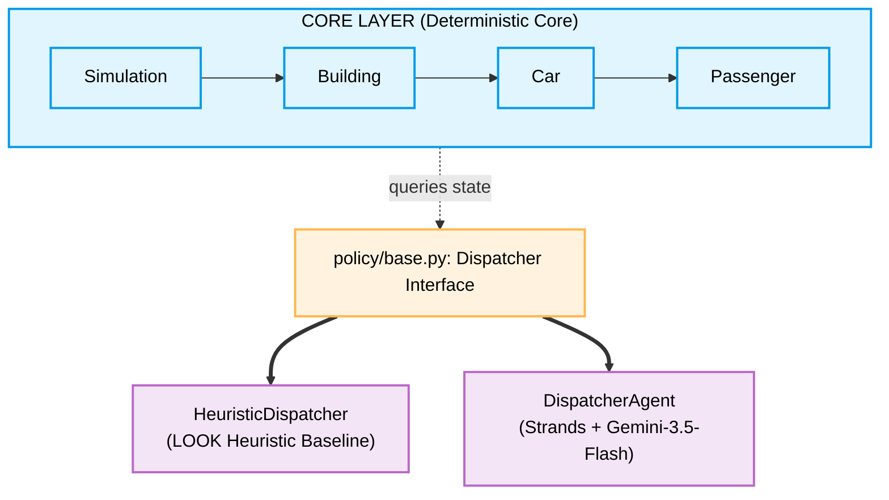

# Design Documentation: Elevator Simulator

This document details the architectural design, time modeling, and separation of concerns implemented in the Elevator Simulator learning build.

---

## 1. Decoupled Architecture

The simulator is explicitly separated into two independent layers connected by a clean interface boundary:

1. **Deterministic Core:**
   * Contains physical structures (`Car`, `Building`), state models (`Passenger`), and time orchestration (`Simulation`).
   * Written in pure, dependency-free Python (no LLM, no Strands, no third-party libraries).
   * Fully unit-testable offline with zero model dependencies or mock wrappers.
2. **Policy Dispatcher Seam:**
   * Defined by the `Dispatcher` Protocol in `src/elevatorsim/policy/base.py`.
   * Standardizes the `dispatch(simulation)` call signature.
   * Enables seamless swapping between heuristic and LLM-backed Strands dispatchers.

---

## 2. Time, Event, and Reproduction Models

### Fixed-Tick Time Model
To keep Tier 0 and Tier 1 transparent and easy to trace, `simulation.py` runs on a **fixed-tick loop** (each step is 1 tick). 
* The car moves exactly 1 floor per tick.
* Doors stay open for exactly 2 ticks.
* Ticking time increment is linear: `current_time += 1`.
* *Upgrade Path:* SimPy is the designated Tier 2 upgrade path to migrate from fixed-tick stepping to asynchronous, event-driven discrete scheduling.

### Stochastic Traffic Generation (Tier 1)
To model realistic building usage, passenger arrivals are generated stochastically using the `TrafficGenerator` module:
* **Arrival Rate:** Determines the probability (0.0 to 1.0) of a passenger spawning at any given simulation tick.
* **Profiles:** Supports three pre-defined traffic distribution patterns:
  * `UNIFORM`: Passengers spawn on any floor, heading to any other floor with uniform probability.
  * `DOWN_PEAK` (Morning rush): Passengers spawn on upper floors (1 to 4) heading to the lobby (floor 0).
  * `UP_PEAK` (Evening rush): Passengers spawn at the lobby (floor 0) heading to upper floors (1 to 4).
* The generator is invoked by the `Simulation` during its tick step and utilizes the central `RNG` for deterministic behavior.

### Domain Events (Logging & Metrics Only)
All state changes emit rich domain events (e.g. `PassengerSpawned`, `CallRegistered`, `CarArrived`, `DoorOpened`, `PassengerBoarded`, `PassengerDeboarded`, `DoorClosed`, `CarMoved`) defined in `events.py`.
* **Important:** These events are used **strictly** for logging, terminal tracing, and metrics collection (`metrics.py`). 
* They do **not** trigger or schedule actions inside the simulation engine. This keeps the time stepping simple and robust.

### Reproducibility & Seeded RNG
* **Seeded RNG:** `config.py` exports a central `RNG` instance (`random.Random(seed)`). Any stochastic logic must use this central generator to ensure that runs remain deterministic.
* **A/B Fairness:** The runner re-seeds the central RNG and completely resets the simulation objects before both the heuristic and agentic runs. This guarantees both dispatchers face the exact same scenario for an apples-to-apples performance comparison.

---

## 3. Rate Limits & API Quotas

To ensure reliability and respect Google AI Studio Free Tier limits (which impose strict rate limits and daily quotas), the project incorporates several protection strategies:

* **Rate-Limiting Sleeps:** In `DispatcherAgent`, we insert a 13-second wait (`time.sleep(13)`) before the initial state observation tool call, and another 13-second wait before calling `.structured_output()`. This 26-second delay per tick prevents hitting Google's 15 Requests Per Minute (RPM) limits.
* **Offline Baseline Mode (Quota Resilience):** The Heuristic LOOK baseline dispatcher operates 100% offline without requiring a `GEMINI_API_KEY`.
* **Skipping Live Runs:** If the `GEMINI_API_KEY` is not detected in the environment or `.env` file, the runners (`run_tier0.py` and `run_tier1.py`) skip the agentic run and gracefully output the heuristic baseline results, preventing runtime crashes.
* **Quota Exhaustion Handling:** In `run_tier1.py`, the agentic execution is wrapped in a `try-except` block. If a quota exhaustion limit is reached, it catches the exception and logs a clean, informative error message instructing the developer how to resolve the issue (e.g. by enabling pay-as-you-go billing).
* **Conserving Daily Quotas:** The default duration for evaluation runs is capped at 50 ticks to conserve API calls. A `--full` command-line flag is available to scale the run up to 150 ticks for paid tiers.

---

## 4. Agentic Design & Gemini Non-Determinism

### Two-Phase Tool Calling + Structured Output
Gemini 3.5 Flash requires tool outputs to be mapped with both `id` and `name` attributes inside `FunctionResponse`. To ensure high reliability, the `DispatcherAgent` executes a two-phase flow:
1. **Phase 1 (Observe):** The agent runs tools (`get_elevator_state`, `get_floor_calls`) and writes an analysis of the building status.
2. **Phase 2 (Decide):** The agent calls `.structured_output(DispatchDecision, prompt)` which carries forward the history from Phase 1 and returns the validated Pydantic decision.

### Gemini Non-Determinism
* **No Temperature:** Google deprecated sampling parameters (`temperature`, `top_p`) on Gemini 3.5 Flash.
* **Thought Preservation:** Thinking is active and cached by default in Gemini 3.5 Flash.
* **Result:** Because we cannot force `temperature=0` and thinking history introduces variability, **agentic dispatch decisions are non-deterministic**.
* **Implication:** The non-deterministic nature of the LLM highlights why having a solid, local LOOK heuristic baseline and recording reproducible simulation trace metrics are crucial for comparison and evaluation.

---

## 5. Scaling Path (Tiers 0-3)

The project is structured to easily scale across tiers:

* **Tier 0 (Walking Skeleton) [Completed]:** 1 car, 5 floors, scripted passengers, LOOK vs. Agentic Dispatcher.
* **Tier 1 (Stochastic Traffic) [Completed]:** Introduce stochastic passenger spawns using the seeded `RNG` and custom traffic profiles (`UNIFORM`, `UP_PEAK`, `DOWN_PEAK`).
* **Tier 2 (Multi-Car Bank) [Next]:** Upgrade to an elevator bank (3-6 cars) using a SimPy time engine. Coordination will leverage Strands **Agents-as-Tools** supervisor primitives (a supervisor agent overseeing individual car agents) or a state **Graph**.
* **Tier 3 (Skyscraper) [Planned]:** Swarm and Workflow orchestration across hierarchical building controllers, exposing MCP servers for config and performance metrics.

---

## 6. Web Application & Real-Time Simulation (WebSockets)

To enable side-by-side comparative visualization and interactive control, the system includes a web application layered on top of the simulator package.

### Architecture overview
* **FastAPI Server (`src/elevatorsim/web/server.py`):** Acts as the simulation server. It hosts REST endpoints for preset caching and API-key checking, and a WebSocket path for live interactive sessions.
* **Vite React Frontend (`src/elevatorsim/web/frontend/`):** Implements a dark-themed glassmorphism dashboard that renders the physical shafts, passenger queues, telemetry metrics, and comparison charts.

### Real-Time WebSockets Engine
When a custom interactive session starts, the frontend opens a persistent WebSocket connection to `/api/ws/simulate`:
1. **Synchronized Dual Instantiation:** The backend spins up separate `Simulation` instances for both LOOK and Gemini dispatchers, using identical seeds and traffic profiles.
2. **Synchronized User Actions:** When the user clicks the UI canvas to spawn a passenger manually, the request is broadcast over the WebSocket. The backend instantiates matching passenger entities and schedules them in both simulators, preserving A/B benchmarking fairness.
3. **Pacing & Worker Thread Isolation:** Because the Gemini dispatcher utilizes a synchronous 26-second rate-limiting delay, calling it directly would block the FastAPI async event loop. To prevent this, the backend executes simulation ticks in separate OS-level threads using `asyncio.to_thread`.
4. **Pull-Based stepping loop:** To handle Gemini latency seamlessly, the frontend runs a pull-based stepping loop. Instead of blindly ticking on a fixed interval, the frontend only triggers the next simulation tick after receiving the state update for the current tick from the server, displaying a visual "Gemini is thinking..." load mask during active agent turns.

