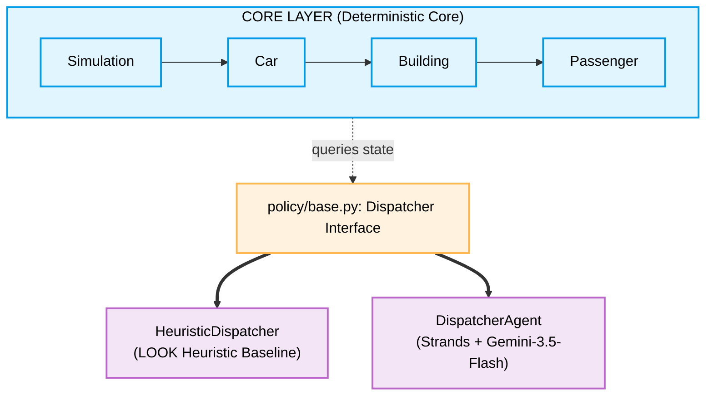

# Design Documentation: Elevator Simulator

This document details the architectural design, time modeling, and separation of concerns implemented in the Elevator Simulator learning build.

---

## 1. Decoupled Architecture

The simulator is explicitly separated into two independent layers connected by a clean interface boundary:

1. **Deterministic Core:**
   * Contains physical structures (`Car`, `Building`), state models (`Passenger`), and time orchestration (`Simulation`).
   * Written in pure, dependency-free Python (no LLM, no Strands, no third-party libraries).
   * Fully unit-testable offline with zero model dependencies or mock wrappers.
2. **Policy Dispatcher Seam:**
   * Defined by the `Dispatcher` Protocol in `src/elevatorsim/policy/base.py`.
   * Standardizes the `dispatch(simulation)` call signature.
   * Enables seamless swapping between heuristic and LLM-backed Strands dispatchers.

---

## 2. Time, Event, and Reproduction Models

### Fixed-Tick Time Model
To keep Tier 0 transparent and easy to trace, `simulation.py` runs on a **fixed-tick loop** (each step is 1 tick). 
* The car moves exactly 1 floor per tick.
* Doors stay open for exactly 2 ticks.
* Ticking time increment is linear: `current_time += 1`.
* *Upgrade Path:* SimPy is the designated Tier 2 upgrade path to migrate from fixed-tick stepping to asynchronous, event-driven discrete scheduling.

### Domain Events (Logging & Metrics Only)
All state changes emit rich domain events (e.g. `PassengerSpawned`, `CarMoved`, `DoorOpened`) defined in `events.py`.
* **Important:** These events are used **strictly** for logging, terminal tracing, and metrics collection (`metrics.py`). 
* They do **not** trigger or schedule actions inside the simulation engine. This keeps the time stepping simple and robust.

### Reproducibility & Seeded RNG
* **Seeded RNG:** `config.py` exports a central `RNG` instance (`random.Random(seed)`). Any stochastic logic must use this central generator to ensure that runs remain deterministic.
* **A/B Fairness:** The runner re-seeds the central RNG and completely resets the simulation objects before both the heuristic and agentic runs. This guarantees both dispatchers face the exact same scenario for an apples-to-apples performance comparison.

---

## 3. Agentic Design & Gemini Non-Determinism

### Two-Phase Tool Calling + Structured Output
Gemini 3.5 Flash requires tool outputs to be mapped with both `id` and `name` attributes inside `FunctionResponse`. To ensure high reliability, the `DispatcherAgent` executes a two-phase flow:
1. **Phase 1 (Observe):** The agent runs tools (`get_elevator_state`, `get_floor_calls`) and writes an analysis of the building status.
2. **Phase 2 (Decide):** The agent calls `.structured_output(DispatchDecision, prompt)` which carries forward the history from Phase 1 and returns the validated Pydantic decision.

### Gemini Non-Determinism
* **No Temperature:** Google deprecated sampling parameters (`temperature`, `top_p`) on Gemini 3.5 Flash.
* **Thought Preservation:** Thinking is active and cached by default in Gemini 3.5 Flash.
* **Result:** Because we cannot force `temperature=0` and thinking history introduces variability, **agentic dispatch decisions are non-deterministic**.
* **Implication:** The non-deterministic nature of the LLM highlights why having a solid, local LOOK heuristic baseline and recording reproducible simulation trace metrics are crucial for comparison and evaluation.

---

## 4. Scaling Path (Tiers 1-3)

The project is structured to easily scale across tiers:

* **Tier 0 (Current):** 1 car, 5 floors, scripted passengers, LOOK vs. Agentic Dispatcher.
* **Tier 1 (Stochastic):** Introduce stochastic passenger spawns using the seeded `RNG` inside the metrics collector.
* **Tier 2 (Multi-Car Bank):** Upgrade to an elevator bank (3-6 cars) using the Strands **Agents-as-Tools** primitive (a supervisor agent overseeing individual car agents) or a state **Graph**. Upgrades the core to SimPy.
* **Tier 3 (Skyscraper):** Swarm and Workflow orchestration across hierarchical building controllers, exposing MCP servers for config and performance metrics.
